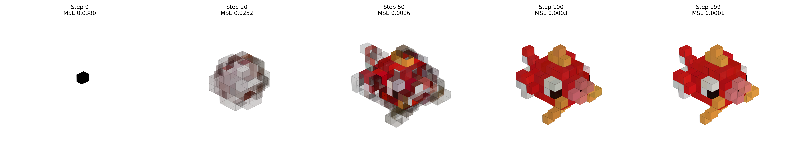

# Deep Learning Project 2021/2022

## Team members

Fabrizio Rossi 1815023

Matteo Orsini 1795119

## Project summary

This project is based on the work of [Mordvintsev, et al. (2020)](https://distill.pub/2020/growing-ca), which proposes a method to model the morphogenesis process using a Neural Cellular Automaton in order to reconstruct 2D images.

In our project, we extended this concept into the 3D domain using voxels. 

In order to do so, we created our dataset composed of different 3D shapes with various sizes and trained a model able to reconstruct the 3D target shapes with good results.

## Repository content
The `deep_learning_project.ipynb` contains the Colab notebook used to develop the project, so it is better viewed directly on the Colab platform:

Inside the `shapes` folder, we uploaded the 3D voxel models used as training data. They are saved in the proprietary format .vox used by the [Voxelator editor](http://voxelator.com/).

In the `videos` folder, instead, we uploaded all the videos that we produced using the pretrained models contained in the notebook.  
For each shape there are three videos with different suffixes:
- `_normal` videos are used to demostrate the persisting capabilities of the model;
- `_damage` videos are produced using a damaged shape as input;
- `_rotate` videos are produced giving as input an angle for the x-axis of 90 degrees.

`damage_visualization.pdf` shows how our damage affects the splash model in 36 different cases, and it is a tool we used in order to assess how good our damage algorithm performed.

Finally, the `splash_steps.png` file, it's the image shown above and represents how the splash model is reconstructed in a normal run.
